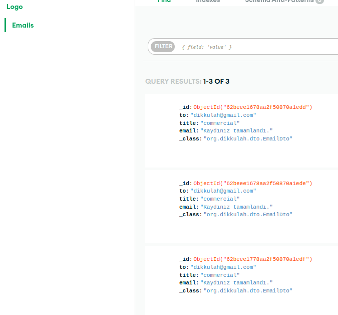
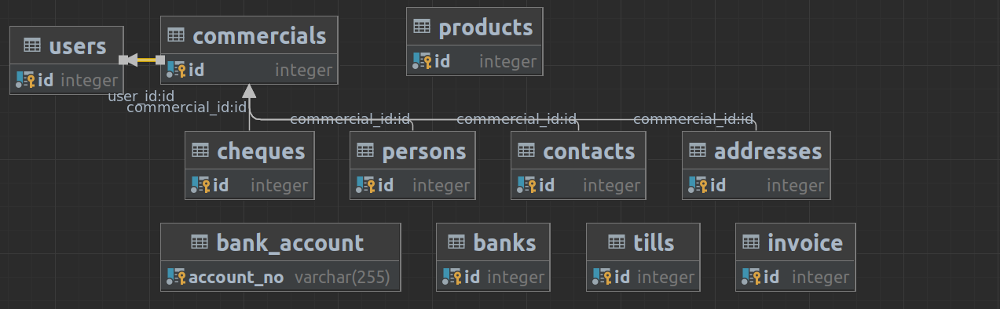
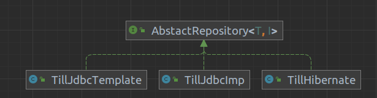

1. Mysql veya PostgreSQL ile controller katmanlarının çalışabilmesi için gerekli repository katmanlarını yazın. Ayrıca
   isbasi-email-service kuyruktan veriyi okuduktan sonra gerekli model class’ını oluşturup tabloya kaydedin.(60 Puan)
   1. Mailler mongodb atlasa kaydedildi.
   2. 
   3. repository/jpa klasörü içerisindeki jpa lar ile kayıtlar sağlandı.
   4.   tablo yapısı.
2. JDBC, JdbcTemplate ve Hibernate ile bir DAO katmanını yazın ve avantajlarını ve dezavantajlarını kendi görüşlerinizle
   beraber yazın. OOP’nin polimorfizm’den yararlanarak aynı tabloya üç yöntem ile CRUD işlemlerini yapan kodu yazınız. (
   30 Puan)
   1. Till clasının işlemleri TillJpa, TillHibernate, TillJdbcTemplate, Tilljdbc ile yapıldı.
   2. 
   3. JDBC, ilişkisel bir veritabanından veri okumak ve verileri güncellemek için SQL komutları yazmamıza izin verir. JPA, JDBC'den farklı olarak, geliştiricilerin nesne yönelimli anlambilim kullanarak veritabanına dayalı Java programları oluşturmasına olanak tanır .
   4. JDBC ile bir sorguda veritabanı tablolarını ilişkilendirirken, tam SQL sorgusunu yazmamız gerekirken  JPA ile bire bir, bire çoğa, çoktan bire ve çok sayıda oluşturmak için ek açıklamaları kullanırız.
   5. JDBC, veritabanına bağımlıdır, bu, farklı veritabanları için farklı komut dosyalarının yazılması gerektiği anlamına gelir . Öte yandan, JPA veritabanından bağımsızdır, yani aynı kod birkaç (veya hiç) değişiklik yapılmadan çeşitli veritabanlarında kullanılabilir
   6. JDBC, SQLException gibi kontrol edilen istisnalar oluşturduğundan, bunu bir try-catch bloğuna yazmalıyız. Öte yandan, JPA çerçevesi yalnızca Hibernate gibi denetlenmeyen istisnalar kullanır . Bu nedenle, kullandığımız her yerde onları yakalamamız veya bildirmemiz gerekmez.
   7. JDBC'nin JPA'ya göre en belirgin yararı, anlaşılmasının daha kolay olmasıdır . Öte yandan, bir geliştirici JPA çerçevesinin veya veritabanı tasarımının iç işleyişini kavraymazsa, iyi kod yazamaz .
   8. Geliştiriciler için JPA'nın JDBC'ye göre ana avantajı, Java uygulamalarını, veritabanı semantiği hakkında endişelenmeden nesne yönelimli ilkeleri ve en iyi uygulamaları kullanarak kodlayabilmeleridir.
3. Aşağıdaki kavramları örneklerle açıklayın ve hangi problemi nasıl çözdüklerini anlatan bir makale yazın.(Medium’da
   paylaşıp linkini koyabilirsiniz.) (10 Puan)
   * Medium yazısı-> [Medium](https://medium.com/@dikkulah/mongodb-coucbase-redis-eb23071c2d05 )
   * MongoDB,
   * Coucbase,
   * Redis
